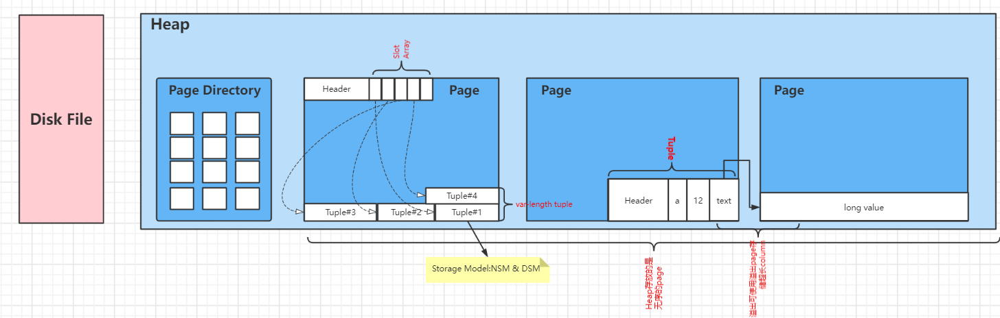

# 数据库系统

> 本次涉及的数据库系统为面向磁盘的关系型数据库。
> 
> 针对此类型数据库，我将从数据库设计着手，先介绍数据库设计（存储、执行、并发控制、恢复、分布式数据）,接着以MySQL为例子详细介绍MySQL对于以上概念的实现。

## 数据库设计

### 存储

#### 磁盘结构

##### File Storage

对于面向磁盘的关系型数据库设计，我们存储到数据库表中的数据最后都会持久化到磁盘。

**那么设计表数据的存储结构和方式则是重中之重**。

假设一个user(id,username,password)表有1000万条数据，数据库系统（如MySQL）都是将该表的数据按照page分块存储到磁盘上的。

对于分page存储，要处理如下问题：

- Page大小

- Page定位

**Page大小**

对于每一个Page的大小，我们需要综合考虑OS Page和硬件Page来决定数据库系统的Page大小。

- Hardware Page 通常是4KB大小，保证数据可靠地写入到硬盘

- OS Page通常是4KB大小

- Database Page通常是512B~16KB， MySQL是16KB

**Page定位**

用于根据`page id`查找page。

可选择的数据结构可以是`Linked List`和`Hash Table`。

通常的做法是使用Hash Table创建一个`Page Directoty`

##### Page Layout

Page用于存储数据库表的tuples，由`Header`、`Slot Array`和`Tuples`构成。

`Header`用于存储关于该`Page`的相关元信息。

`Slot Array`用于存储Tuple的相较于文件末尾的offset(偏移量)。新增tuple时总是总末尾空闲处新增。

`Tuple`则是数据库表的一条记录，长度不固定。

##### Tuple Layout

`Tuple`表示数据库表中的一条数据。

#### 内存结构

!> todo

## MySQL

!> TODO
