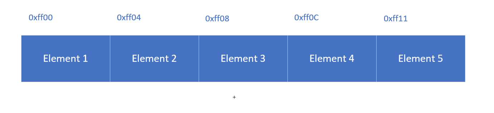
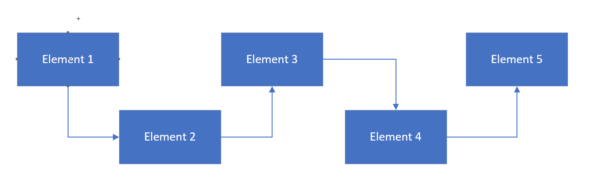

# Java基础

## 数据类型

Java数据类型分为基础数据类型和引用类型。

### 基础数据类型

Java基础数据类型又可以细分为整型、浮点型、字符型和布尔型。

**整型**：整型根据bit位数又分为byte、short、int、long.

- **byte**:  8bit，1字节。表示范围是$~2^{-7}$ ~  $(2^7-1)$  (-128~127)

- **short**: 16bits，2字节。表示范围是$~2^{-15}$ ~ $(~2^{-15} - 1)$.

- **int**：32bits，4字节。表示范围$~2^{-31}$ ~ $(~2^{-31} - 1)$.

- **long**：64bits，8字节。表示范围$~2^{-63}$ ~ $(~2^{-63} - 1)$.

**浮点型**：浮点型分为float、double

- float：32bits，4字节。

- double：64bits,8字节。

**字符型**：字符型只有char类型，16bit unicode，2字节。

**布尔型**：布尔型只有boolean类型，包含true和false。

### 引用类型

除了基本类型外都是引用类型。比如String、Integer等。

**包装类**

包装类是为了泛型能够使用基本数据类型而提出的类，与基本数据类型一一对应。

如 `int`  和 `Integer` ，`char` 和 `Character` 。

**String**

## 集合

在Java类库里，集合主要有两个分支，分别是`Collection` 和 `Map`。

其中，`Collection`包含 `List`和 `Set`两个类别。

一般语义下，`List`有顺序的概念，而 `Set`没有顺序的概念。此外 `List`允许元素重复， `            Set不允许元素重复`。

!> Set没有顺序的概念不是绝对的，比如 `TreeSet`(`Set`的一种具体实现)就引入了顺序的概念。

下面我们分别看看 `List` 和 `Set`有哪些具体实现方案。

### List

`List` 允许元素重复，且元素之间有顺序的概念。

根据元素存储在内容中是否具有连续性分为`ArrayList` 和 `LinkedList`。

- **ArrayList**：在实现层面使用数组存储元素，连续下标的元素在内存中的地址是连续的。所以查询或顺序访问效率高。不过对非末尾元素的插入和删除效率较低，原因在于在数组中间插入或者删除元素需要将右边的元素逐一移动来满足插入和删除。

- **LinkedList**：俗称链表，底层是使用引用来链接链表内的元素。如果链表的其中一个元素只有指向下一个元素的引用，被称为单链表；如果元素既有上一个元素的引用，又有下一个元素的引用，成为双链表。在JDK的实现中，`LinkedList`是双链表。

